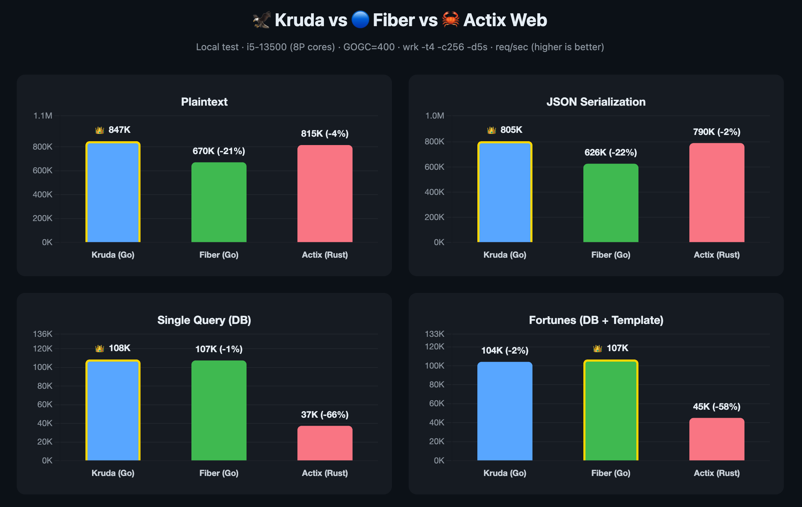

# Kruda

Fast by default, type-safe by design.

[](https://go.dev)
[](https://github.com/go-kruda/kruda/actions/workflows/test.yml)
[](https://codecov.io/gh/go-kruda/kruda)
[](https://goreportcard.com/report/github.com/go-kruda/kruda)
[](LICENSE)

## Why Kruda?

- Typed handlers `C[T]` — body + param + query parsed into one struct, validated at compile time
- Auto CRUD — implement `ResourceService[T]`, get 5 REST endpoints
- Built-in DI — optional, no codegen, type-safe generics
- Pluggable transport — Wing (Linux, epoll+eventfd), fasthttp, or net/http
- Minimal deps — Sonic JSON (opt-out via `kruda_stdjson`), pluggable transport
- Dev mode error page — rich HTML with source code context, like Next.js

## Quick Start

```bash
go get github.com/go-kruda/kruda
```

```go
package main

import (
    "github.com/go-kruda/kruda"
    "github.com/go-kruda/kruda/middleware"
)

func main() {
    app := kruda.New()
    app.Use(middleware.Recovery(), middleware.Logger())

    app.Get("/ping", func(c *kruda.Ctx) error {
        return c.JSON(kruda.Map{"pong": true})
    })

    app.Listen(":3000")
}
```

## Typed Handlers

```go
type CreateUser struct {
    Name  string `json:"name" validate:"required,min=2"`
    Email string `json:"email" validate:"required,email"`
}

type User struct {
    ID    string `json:"id"`
    Name  string `json:"name"`
    Email string `json:"email"`
}

kruda.Post[CreateUser, User](app, "/users", func(c *kruda.C[CreateUser]) (*User, error) {
    return &User{ID: "1", Name: c.In.Name, Email: c.In.Email}, nil
})
```

## Auto CRUD

```go
kruda.Resource[User, string](app, "/users", &UserCRUD{db: db})
// Registers: GET /users, GET /users/:id, POST /users, PUT /users/:id, DELETE /users/:id
```

## Dependency Injection

```go
c := kruda.NewContainer()
c.Give(&UserService{})
c.GiveLazy(func() (*DBPool, error) { return connectDB() })
c.GiveNamed("write", &DB{DSN: "primary"})

app := kruda.New(kruda.WithContainer(c))
app.Get("/users", func(c *kruda.Ctx) error {
    svc := kruda.MustResolve[*UserService](c)
    return c.JSON(svc.ListAll())
})
```

## Error Mapping

```go
app.MapError(ErrNotFound, 404, "resource not found")
kruda.MapErrorType[*ValidationError](app, 422, "validation failed")
```

## Coming from Another Framework?

| Concept | Gin | Fiber | Echo | stdlib | Kruda |
|---------|-----|-------|------|--------|-------|
| App | `gin.Default()` | `fiber.New()` | `echo.New()` | `http.NewServeMux()` | `kruda.New()` |
| Route | `r.GET("/path", h)` | `app.Get("/path", h)` | `e.GET("/path", h)` | `mux.HandleFunc("GET /path", h)` | `app.Get("/path", h)` |
| Typed handler | — | — | — | — | `kruda.Post[In, Out](app, "/path", h)` |
| Group | `r.Group("/api")` | `app.Group("/api")` | `e.Group("/api")` | — | `app.Group("/api")` |
| Middleware | `r.Use(mw)` | `app.Use(mw)` | `e.Use(mw)` | — | `app.Use(mw)` |
| Context | `*gin.Context` | `*fiber.Ctx` | `echo.Context` | `http.ResponseWriter, *http.Request` | `*kruda.Ctx` |
| JSON response | `c.JSON(200, obj)` | `c.JSON(obj)` | `c.JSON(200, obj)` | `json.NewEncoder(w).Encode(obj)` | `return &obj, nil` |
| Path param | `c.Param("id")` | `c.Params("id")` | `c.Param("id")` | `r.PathValue("id")` | `c.Param("id")` |
| Query param | `c.Query("q")` | `c.Query("q")` | `c.QueryParam("q")` | `r.URL.Query().Get("q")` | `c.Query("q")` |
| Body binding | `c.ShouldBindJSON(&v)` | `c.BodyParser(&v)` | `c.Bind(&v)` | `json.NewDecoder(r.Body).Decode(&v)` | `c.Bind(&v)` or `C[T].In` |
| Auto CRUD | — | — | — | — | `kruda.Resource[T, ID](app, "/path", svc)` |
| DI | — | — | — | — | `Container.Give()` / `MustResolve[T](c)` |

> Full migration guides: [Gin](docs/guide/coming-from-gin.md) · [Fiber](docs/guide/coming-from-fiber.md) · [Echo](docs/guide/coming-from-echo.md) · [stdlib](docs/guide/coming-from-stdlib.md)

## Benchmarks

<p align="center">
  
</p>

Measured with `wrk -t4 -c256 -d5s` on Linux i5-13500 (8P cores), GOGC=400.

| Test | Kruda (Go) | Fiber (Go) | Actix (Rust) | vs Fiber | vs Actix |
|------|--:|--:|--:|--:|--:|
| plaintext | **846,622** | 670,240 | 814,652 | +26% | +4% |
| JSON | **805,124** | 625,839 | 790,362 | +29% | +2% |
| db | **108,468** | 107,450 | 37,373 | +1% | +190% |
| fortunes | 104,144 | **106,623** | 45,078 | -2% | +131% |

Wing transport uses raw `epoll` + `eventfd` on Linux — bypasses both fasthttp and net/http. macOS defaults to fasthttp.

- See [`bench/reproducible/`](bench/reproducible/) for full source code of all 3 frameworks and reproduction steps

## Documentation

Full documentation at [kruda.dev](https://kruda.dev):

- [Getting Started](https://kruda.dev/guide/getting-started)
- [Routing](https://kruda.dev/guide/routing)
- [Typed Handlers](https://kruda.dev/guide/handlers)
- [Middleware](https://kruda.dev/guide/middleware)
- [Transport](https://kruda.dev/guide/transport) — Wing, fasthttp, net/http
- [Performance](https://kruda.dev/guide/performance) — benchmarks & tuning
- [Security](https://kruda.dev/guide/security) — headers, path traversal, rate limiting
- [DI Container](https://kruda.dev/guide/di-container)
- [Error Handling](https://kruda.dev/guide/error-handling)
- [API Reference](https://kruda.dev/api/app)

## Security

See [SECURITY.md](SECURITY.md) for our responsible disclosure policy.

### Security Hardening (Recommended)

```go
import (
    "os"
    "time"

    "github.com/go-kruda/kruda"
    "github.com/go-kruda/kruda/middleware"
    "github.com/go-kruda/kruda/contrib/jwt"
    "github.com/go-kruda/kruda/contrib/ratelimit"
)

app := kruda.New(
    kruda.WithBodyLimit(1024 * 1024), // 1MB body limit
    kruda.WithReadTimeout(10 * time.Second),
)

// Rate limiting — 100 req/min per IP
app.Use(ratelimit.New(ratelimit.Config{
    Max: 100, Window: time.Minute,
    TrustedProxies: []string{"10.0.0.1", "10.0.0.2"},
}))

// Stricter limit on auth endpoints
app.Use(ratelimit.ForRoute("/api/login", 5, time.Minute))

// JWT authentication on protected routes
api := app.Group("/api").Guard(jwt.New(jwt.Config{
    Secret: []byte(os.Getenv("JWT_SECRET")),
}))
```

### Contrib Modules

| Module | Install | Description |
|--------|---------|-------------|
| [contrib/jwt](contrib/jwt/) | `go get github.com/go-kruda/kruda/contrib/jwt` | JWT sign, verify, refresh (HS256/384/512, RS256) |
| [contrib/ws](contrib/ws/) | `go get github.com/go-kruda/kruda/contrib/ws` | WebSocket upgrade, RFC 6455 frames, ping/pong |
| [contrib/ratelimit](contrib/ratelimit/) | `go get github.com/go-kruda/kruda/contrib/ratelimit` | Token bucket / sliding window rate limiting |
| [contrib/session](contrib/session/) | `go get github.com/go-kruda/kruda/contrib/session` | Session middleware with pluggable store |
| [contrib/compress](contrib/compress/) | `go get github.com/go-kruda/kruda/contrib/compress` | Response compression (gzip, deflate) |
| [contrib/etag](contrib/etag/) | `go get github.com/go-kruda/kruda/contrib/etag` | ETag response caching |
| [contrib/cache](contrib/cache/) | `go get github.com/go-kruda/kruda/contrib/cache` | Response cache (in-memory, Redis) |
| [contrib/otel](contrib/otel/) | `go get github.com/go-kruda/kruda/contrib/otel` | OpenTelemetry tracing |
| [contrib/prometheus](contrib/prometheus/) | `go get github.com/go-kruda/kruda/contrib/prometheus` | Prometheus metrics |
| [contrib/swagger](contrib/swagger/) | `go get github.com/go-kruda/kruda/contrib/swagger` | Swagger UI HTML |

### Pre-release Checklist

Run vulnerability scan before every release:

```bash
# Install govulncheck (one-time)
go install golang.org/x/vuln/cmd/govulncheck@latest

# Scan root module
govulncheck ./...

# Scan Wing transport module
cd transport/wing && govulncheck ./...
```

Kruda core has minimal external dependencies (Sonic JSON, fasthttp). Use `kruda_stdjson` build tag to switch to stdlib JSON. Upgrade to the latest Go patch release for security fixes.

**Minimum Go version for zero stdlib vulnerabilities:** go1.25.8+

## Contributing

Contributions welcome. Please read the [Contributing Guide](CONTRIBUTING.md) before submitting a PR.

## License

[MIT](LICENSE)
