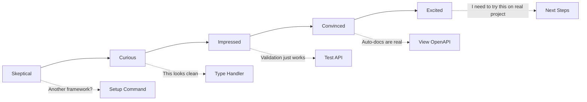

# Kruda First 5-Minute Experience Design

## Experience Goals
- **See:** Performance gains are real and measurable
- **Do:** Build working API with auto-validation in <5 minutes  
- **Feel:** "This actually solves my daily pain points"

## Minute-by-Minute Flow

### Minute 0-1: Landing & Setup
**Touchpoint:** GitHub README / Documentation site  
**Action:** Copy-paste quick start command  
```bash
go mod init kruda-demo && go get github.com/kruda-dev/kruda
```

**Key Messages:**
- "Zero dependencies, stdlib compatible"
- "2x faster than Fiber (benchmarks below)"
- "Auto-validation, auto-OpenAPI"

**Success Metric:** Command executes without errors

### Minute 1-3: First API
**Touchpoint:** Getting started guide  
**Action:** Create main.go with typed handler  

```go
package main

import "github.com/kruda-dev/kruda"

type User struct {
    Name  string `json:"name" validate:"required"`
    Email string `json:"email" validate:"email"`
}

func CreateUser(user User) User {
    // Auto-validation happens here
    return user
}

func main() {
    app := kruda.New()
    app.POST("/users", CreateUser)
    app.Run(":8080")
}
```

**Key Messages:**
- "No manual binding code needed"
- "Validation happens automatically"
- "Type-safe handlers"

**Success Metric:** Server starts, accepts requests

### Minute 3-4: Test & Validate
**Touchpoint:** Terminal / curl commands  
**Action:** Test both valid and invalid requests  

```bash
# Valid request
curl -X POST localhost:8080/users -d '{"name":"John","email":"john@example.com"}'

# Invalid request (auto-validation kicks in)
curl -X POST localhost:8080/users -d '{"name":"","email":"invalid"}'
```

**Key Messages:**
- "Validation errors are automatic and clear"
- "No boilerplate validation code"

**Success Metric:** See validation working without writing validation logic

### Minute 4-5: Auto-OpenAPI Discovery
**Touchpoint:** Browser at localhost:8080/docs  
**Action:** View auto-generated API documentation  

**Key Messages:**
- "OpenAPI spec generated from your types"
- "No manual documentation needed"
- "Frontend team can use this immediately"

**Success Metric:** See interactive API docs

## Emotional Journey



## Critical Success Factors

### Must Work Perfectly
1. **Zero-config setup** - Single command, no configuration files
2. **Immediate feedback** - Server starts in <2 seconds
3. **Validation demonstration** - Clear error messages for invalid input
4. **Auto-OpenAPI proof** - Visible documentation generation

### Must Avoid
1. **Complex examples** - No database, no authentication, no middleware
2. **Configuration overhead** - No YAML files, no environment setup
3. **Unclear error messages** - Every error must be actionable
4. **Performance claims without proof** - Include benchmark comparison

## Onboarding Wireframe Structure

```
┌─────────────────────────────────────────┐
│ KRUDA - Go Web Framework                │
│ ┌─────────────────────────────────────┐ │
│ │ 🚀 2x faster than Fiber            │ │
│ │ 🔒 Zero dependencies                │ │  
│ │ ⚡ Auto-validation & OpenAPI        │ │
│ └─────────────────────────────────────┘ │
│                                         │
│ Quick Start (< 5 minutes):              │
│ ┌─────────────────────────────────────┐ │
│ │ $ go mod init demo                  │ │
│ │ $ go get github.com/kruda-dev/kruda │ │
│ └─────────────────────────────────────┘ │
│                                         │
│ [Copy Code Example] [View Benchmarks]   │
│                                         │
│ ✅ Stdlib compatible                    │
│ ✅ Type-safe handlers                   │
│ ✅ Production ready                     │
└─────────────────────────────────────────┘
```

## Success Metrics
- **Time to first request:** <3 minutes
- **Validation demonstration:** 100% of users see it work
- **Auto-OpenAPI discovery:** >80% visit /docs endpoint
- **Next action rate:** >60% star repo or read more docs
- **Error rate:** <5% encounter setup issues