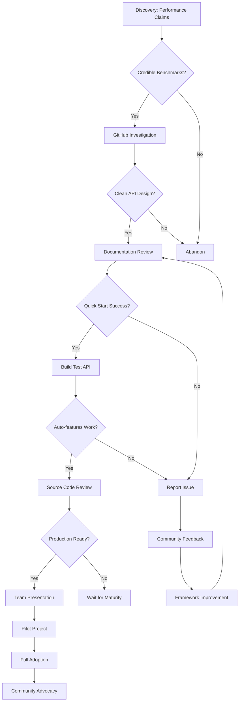

# Kruda Adoption Journey Map

| Stage | Touchpoint | Action | Thought | Emotion | Opportunity |
|-------|------------|--------|---------|---------|-------------|
| **Discovery** | HackerNews/Reddit | Sees "2x faster than Fiber" claim | "Another framework? Prove it." | Skeptical | Benchmark comparison with reproducible results |
| **Initial Interest** | GitHub README | Scans code examples | "Looks clean, but is it production-ready?" | Cautious curiosity | Clear production usage examples |
| **Evaluation** | Documentation | Reads getting started guide | "Where's the catch? What am I giving up?" | Analytical | Honest trade-offs section |
| **First Try** | Local development | `go mod init && go get kruda` | "This better work in 5 minutes" | Impatient | Zero-config quick start |
| **Proof of Concept** | Building test API | Implements CRUD endpoints | "Auto-validation actually works..." | Surprised delight | More complex examples |
| **Deep Dive** | Source code review | Reads Wing transport code | "No CGO, pure Go. Impressive." | Growing confidence | Architecture documentation |
| **Team Discussion** | Slack/meetings | Presents findings to team | "We should pilot this on new service" | Advocacy | Migration guides from Gin/Fiber |
| **Pilot Project** | Production staging | Deploys first service | "Performance gains are real" | Validation | Monitoring/observability guides |
| **Adoption Decision** | Architecture review | Compares with alternatives | "This solves our real problems" | Conviction | Enterprise support options |
| **Rollout** | Multiple services | Migrates existing APIs | "Team velocity increased" | Satisfaction | Community showcase |
| **Advocacy** | Conference talks | Shares success story | "We're all-in on Kruda" | Evangelism | Speaker program |

## Visual Flow
