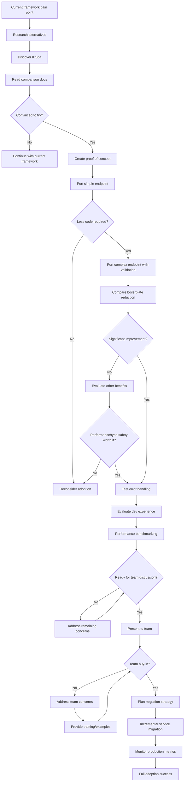

# User Flow: Framework Migration Journey

## Flow Diagram

## Migration Stages

### Stage 1: Evaluation (1-2 weeks)
- **Trigger:** Pain with current framework (performance, boilerplate, errors)
- **Activities:** Research, proof of concept, basic comparison
- **Success Criteria:** Clear advantage demonstrated

### Stage 2: Technical Validation (2-4 weeks)  
- **Activities:** Port representative endpoints, test edge cases, benchmark
- **Stakeholders:** Senior developers, architects
- **Success Criteria:** Technical requirements met or exceeded

### Stage 3: Team Alignment (1-2 weeks)
- **Activities:** Team presentation, address concerns, plan training
- **Stakeholders:** Full development team, engineering management
- **Success Criteria:** Team consensus and migration plan

### Stage 4: Incremental Migration (4-12 weeks)
- **Activities:** Service-by-service migration, monitoring, optimization
- **Success Criteria:** Production stability maintained, metrics improved

## Common Objections & Responses

### "Another framework to learn"
- **Response:** Familiar patterns, minimal learning curve
- **Evidence:** Migration examples, time-to-productivity metrics

### "Ecosystem maturity concerns"  
- **Response:** Core stability, growing community, enterprise adoption
- **Evidence:** Production case studies, roadmap transparency

### "Performance unknown"
- **Response:** Benchmarks vs current framework
- **Evidence:** TechEmpower results, real-world performance data

### "Team training overhead"
- **Response:** Gradual adoption, comprehensive documentation
- **Evidence:** Training materials, migration guides

## Success Metrics

### Technical Metrics
- **Code reduction:** 60-70% less boilerplate
- **Error reduction:** Fewer runtime parsing errors
- **Performance:** Maintained or improved response times

### Team Metrics  
- **Velocity:** Faster feature development
- **Quality:** Reduced production bugs
- **Satisfaction:** Developer happiness scores

### Business Metrics
- **Time to market:** Faster feature delivery
- **Reliability:** Improved uptime
- **Maintenance:** Reduced technical debt