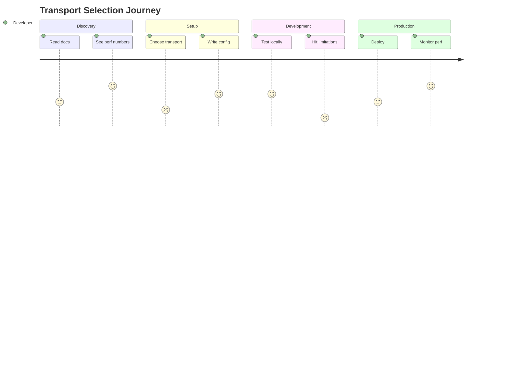

# Transport Selection User Journey

| Stage | Touchpoint | Action | Thought | Emotion | Opportunity |
|-------|------------|--------|---------|---------|-------------|
| **Discovery** | Documentation | Reads getting started guide | "How do I get maximum performance?" | Curious | Clear perf comparison table |
| **Initial Setup** | Code Editor | Writes `kruda.New()` | "Will this be fast enough?" | Uncertain | Smart defaults with visibility |
| **Development** | Local Testing | Runs benchmarks | "Why is this slower than expected?" | Frustrated | Built-in performance hints |
| **Feature Need** | Implementation | Adds file upload | "Does this break with fasthttp?" | Worried | Proactive compatibility warnings |
| **Production** | Deployment | Monitors metrics | "Should I have used net/http?" | Regretful | Runtime transport switching |
| **Optimization** | Performance Tuning | Changes transport config | "What am I losing with this change?" | Confident | Clear trade-off documentation |

